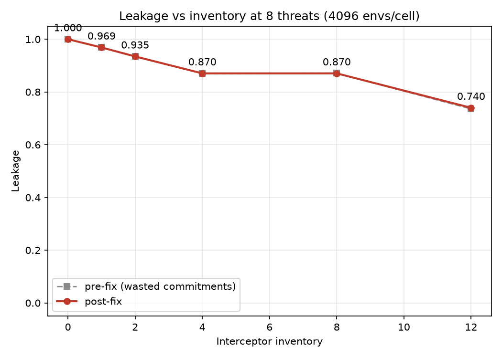
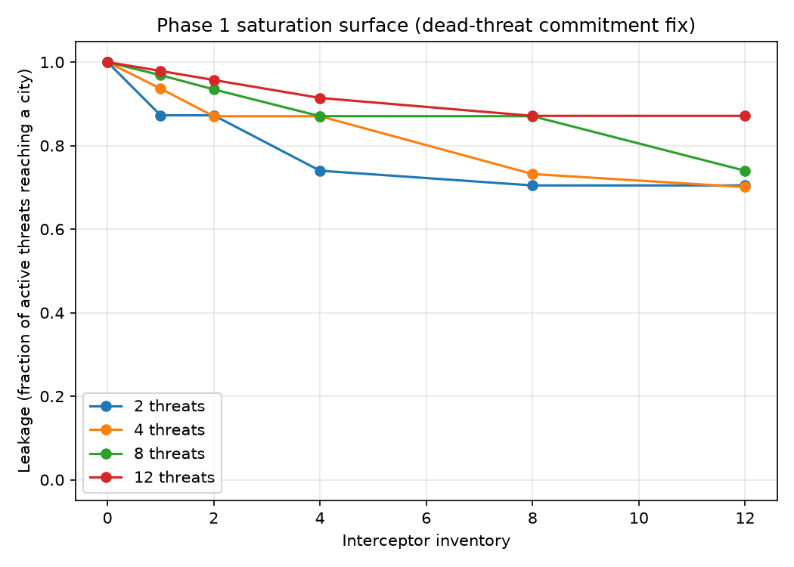

# Vectorized Interception Engine

A vectorized, GPU-resident 3D interception sandbox: batched tensor physics, radar with
noise, Kalman tracking, proportional-navigation guidance, and weapon-target assignment
across thousands of parallel environments. Built as a student research project on
public, approximate data.

[](https://github.com/AlanJacob387/missile-intercept/actions/workflows/tests.yml)

## Verification

- The batched engine is checked against an independent, loop-based NumPy reference
  implementation in float64. Position and covariance agree to machine precision --
  deviations around 1e-16, at the limit of double-precision arithmetic, not an
  engineering tolerance.
- 221 tests, covering physics, sensing, guidance, engagement, and information
  separation.
- The Kalman tracker is checked by NEES, not just "it runs": mean NEES over 500
  independent runs falls inside the chi-square 95% interval (6.23, against bounds of
  5.70-6.31). A companion test feeds the same filter an untransformed Cartesian
  measurement covariance instead of the correct spherical-to-Cartesian transform, and
  NEES jumps to 113.8 -- about 18x over the upper bound -- confirming the consistency
  check actually has teeth rather than passing regardless of what R is.
- Randomness is a counter-based hash keyed on environment index, not a stateful
  generator, so environment i produces bit-identical noise whether it runs alone or
  inside a batch of any size.

## Results



The saturation curve is real but shallow: leakage falls as inventory grows, but it
does not reach zero even with a surplus of interceptors over threats. Single-shot
doctrine caps effectiveness per engagement, so adding rounds mostly buys more
attempts rather than better outcomes. Salvo -- committing more than one round per
threat -- is the lever that would move this further, and it is deferred to later work.



## Arsenal data

Every weapon statistic in `configs/arsenal/` is a public approximation, cited per
entry in a `sources` list. Nothing here is measured performance of any real system.

Each entry also carries an `assumed` list naming the numeric fields that no cited
source states — those are modeling choices, and no citation backs them. A separate
`calibrated` list marks fields tuned until the model reproduced an independent
published observable; Scud-B's ballistic coefficient is the only one, set to place
terminal speed inside the SRBM Mach 3-8 anchor. Calibrated is not sourced: the
evidence is the model's own output, not a measurement. This matters
more than it might look: of the seven threat entries, the cited pages state a range
for all of them and a speed for none, so every `terminal_speed_mps` is a class-level
anchor rather than a transcription. Interceptor lateral-g limits, reaction times, and
magazine depths are likewise unsourced. Where a source gives a band rather than a
point value, the entry takes the upper bound and its `notes` say so. Published
engagement ranges are quoted under unstated conditions, so the `[min, max]` envelope
bands are simplifications, and several lower bounds are layer-handoff choices rather
than published minima.

The tests in `tests/test_arsenal_citations.py` enforce this structurally: a numeric
field is covered by a citation, flagged assumed, or flagged calibrated — never none
of the three, and never both flags at once.

## Stack

PyTorch with the Intel XPU backend (`torch.xpu`), Windows-native. State tensors carry a
leading `N_envs` dimension and every layer is written batched, so one step advances all
environments on device. `torch.compile` is supported on Windows XPU from PyTorch 2.7
(not yet enabled here). The backend resolver falls back `xpu -> cuda -> cpu` and
reports which one it selected; CI runs on the CPU path.

## Install

Requires Python 3.11 or newer.

```
python -m venv .venv
.venv/Scripts/activate      # Windows; use .venv/bin/activate elsewhere
pip install torch --index-url https://download.pytorch.org/whl/xpu
pip install -e .
```

The XPU wheel must come from PyTorch's own index. The default PyPI wheel is CPU-only on
Windows, and `torch.xpu.is_available()` will report False.

## Test

```
pytest
python scripts/validate_batching.py
```

The batch-equivalence gate compares the tensor engine against an independent NumPy
reference implementation at machine precision. Tests marked `slow` (multi-thousand-step
engagements and the saturation sweep) run as part of the full suite but are excluded
from CI; run them locally with `pytest -m "not slow"` to skip them or `pytest -m slow`
to run only them.

---

Licensed under the Apache License, Version 2.0. See `LICENSE`.

*Educational simulation. Not a targeting aid; models no classified performance. All
weapon statistics are published public estimates, cited per entry and labeled as a
model.*
